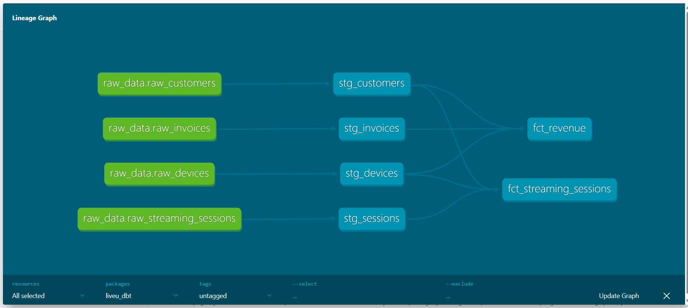
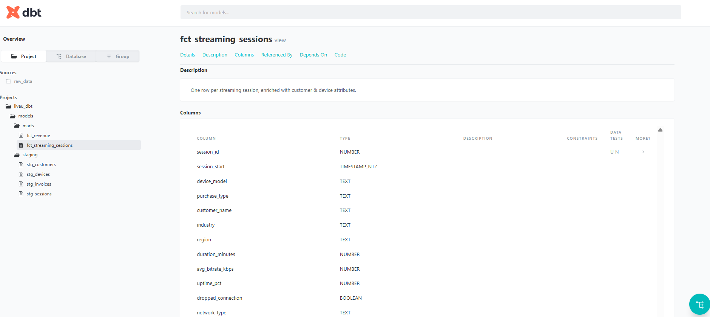
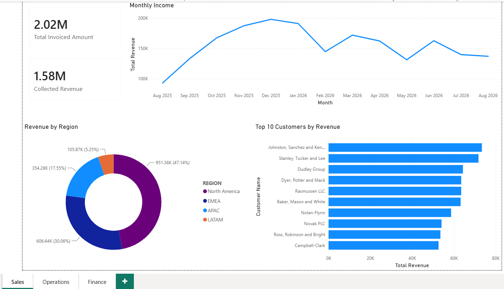
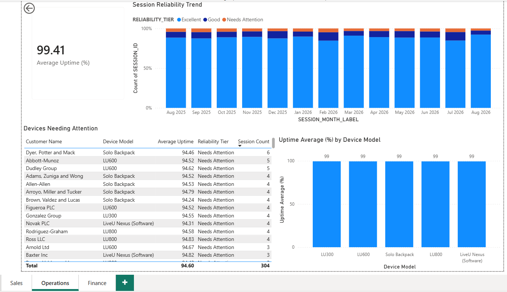
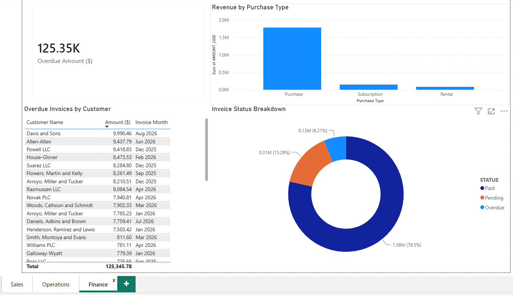

# LiveU Streaming Analytics

A small end-to-end analytics engineering project simulating LiveU's business:
customers renting/purchasing field units, live streaming sessions with
reliability metrics, and revenue - built to demonstrate hands-on experience
with the Snowflake and dbt stack following a technical interview discussion.

> **Disclaimer:** This is an independent portfolio project based only on
> publicly available information. All data is synthetic and does not
> represent actual LiveU customers, operations, pricing, or performance.

## Why this project

LiveU serves broadcasters, sports organizations, and public safety agencies
with mission-critical live video, and its Finance, Operations, and Sales
teams each need different visibility into the same underlying data
(equipment reliability, revenue, customer usage). This project models
that scenario end-to-end, from synthetic raw data through a governed
transformation layer to a business-facing dashboard.

## Architecture

Synthetic data (Python/Faker) → Snowflake (raw layer) → dbt
(staging → marts, with tests & documentation) → Power BI dashboard



## Stack
- **Data generation:** Python (pandas, Faker)
- **Warehouse:** Snowflake
- **Transformation:** dbt Core (staging views, marts tables, dbt tests, dbt docs)
- **BI:** Power BI - 3 dashboards for Sales, Operations, and Finance

## Data model
- `stg_*` (views) - light cleaning and type-casting of raw source tables
- `fct_streaming_sessions` (table) - one row per streaming session, enriched
  with customer and device attributes, with a calculated reliability tier
- `fct_revenue` (table) - invoice-level revenue enriched with customer
  segment. Includes both `amount_usd` (total invoiced) and
  `collected_amount_usd` (paid invoices only) - an important distinction
  between invoiced and collected revenue

Staging models are materialized as views (lightweight, always reflect the
latest raw data). Marts are materialized as tables, since the dashboard
queries them directly and benefits from faster read performance.

Data quality is enforced with 29 dbt tests: `unique` and `not_null` on
primary/foreign keys, `relationships` tests validating referential
integrity between sessions, devices, customers and invoices,
`accepted_values` on status/category fields, and `dbt_utils.accepted_range`
on `uptime_pct` (0-100) and `amount_usd` (non-negative).



## Dashboards

### Sales
Monthly revenue trend, top customers, and revenue by region. Shows both
total invoiced amount and collected revenue as separate KPIs.


### Operations
Device reliability (uptime %) by model, session reliability trend over
time, and a drill-down table of devices needing attention.


### Finance
Overdue amount, invoice status breakdown, and revenue by purchase type
(Purchase / Rental / Subscription).


## How to run this project

### Prerequisites
- Python 3.x
- A Snowflake account (trial works fine)
- dbt Core with the Snowflake adapter: `pip install dbt-snowflake`
- Git

### 1. Generate the data
```bash
pip install faker pandas numpy
python generate_data.py
```
This creates 4 CSV files in `data/`: `raw_customers.csv`, `raw_devices.csv`,
`raw_streaming_sessions.csv`, `raw_invoices.csv`.

### 2. Load the data into Snowflake
In Snowsight, create a database and schema:
```sql
CREATE DATABASE LIVEU_RAW;
CREATE SCHEMA LIVEU_RAW.PUBLIC;
```
Then load each CSV as a table via **Data → Create Table → From File**,
naming them `RAW_CUSTOMERS`, `RAW_DEVICES`, `RAW_STREAMING_SESSIONS`,
`RAW_INVOICES`.

### 3. Configure dbt
Set up a `profiles.yml` (see `liveu_dbt/profiles.yml.example` for the
expected structure - do not commit real credentials) pointing at your
Snowflake account, with `database: LIVEU_RAW` and `schema: ANALYTICS`.

### 4. Run dbt
```bash
cd liveu_dbt
dbt deps      # installs the dbt_utils package
dbt debug     # verifies the connection
dbt run       # builds staging views and marts tables
dbt test      # runs all 29 data quality tests
dbt docs generate
dbt docs serve  # opens interactive docs with the lineage graph
```

### 5. Open the dashboard
Open `dashboard/LiveU_Analytics_Dashboard.pbix` in Power BI Desktop and
refresh the data source to connect to your own Snowflake instance.

## What I'd do next with more time
- Incremental models with a `merge` strategy for the sessions fact table
- Deduplication logic for late-arriving/updated records
  (`qualify row_number() over (...)`)
- CI with GitHub Actions running `dbt test` on every PR
- Source freshness checks
- A dbt Projects on Snowflake / Workspaces version, alongside the local
  dbt Core setup used here